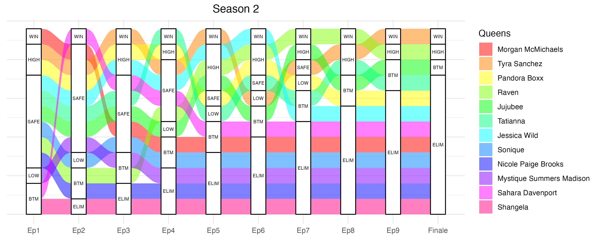

```{r setup, include=FALSE}
knitr::opts_chunk$set(echo = FALSE)
library(knitr)
library(kableExtra)
```

<!-- \newpage -->

# Introduction 


  <!-- # - \usepackage{float} -->
  <!-- # - \floatplacement{figure}{H} -->

This projects aims at investigating the predictive value of outcomes from the award-winning TV show RuPaul's Drag Race. RuPaul's Drag Race is an American reality competition television series that first aired in 2009 and currently counts 14 seasons. The original American show has given rise to  spin-offs such as RuPaul's Drag Race All Stars, and international versions such as in Canada, UK, France, Thailand, Holland, Spain, Australia/New Zealand, and Italy. This project will focus specifically on the original American version of the show, and including all seasons that has aired to date, namely seasons 1 through 14. 

In each iteration of the competition, 9 to 16 contestant participate in weekly challenges assessing their drag queen qualities. Contestants are called "queens", which is short for "drag queens" or drag performers.  They are eliminated one by one until a winner is declared and earns the title of "America's Next Drag Superstar". The challenges include designing, sewing, dancing, singing, performing lip-synchs, acting and comedy. 

The worldwide community of fans of the show are very active online. A part of the online discussions of the show include discussions on whether the winner of particular titles can be predicted based on some specific factors. There is for example a very wide spread belief that winning the fan-favorite "Snatch Game" challenge is a great predictor for winning the overall competition. This is supported by the wins from Jinkx Monsoon, Bob the Drag Queen, Aquaria, and Gigi Goode in seasons 5, 8, 10, 12. Another example that is frequently mentioned on the show is the supposed superiority of contestants who are from New York City. 
The aim of this project is to assess whether some of these variable are actually predictive of one of two outcomes: a) winning the competition, or b) being crowned "Miss congeniality", a honorary title given to one of the participants who showed the most friendly and positive spirits and behavior during the competition. I choose exposure variables to include some of the most frequently discussed factors in the fan community, as well as socio-demographic factors that may affect the performance. The exposure variables I will consider are: age of contestant when the show aired, the homestate of the participant, whether the contestant participate in the final episode (the finale), their overall rank, whether the contestant won the "Snatch Game" comedy impersonation challenge, and their number of mini-challenge wins, number of times winning a maxi-challenge, number of times ranking in the 'win ,'win or high', 'safe', 'low or bottom', and 'bottom' categories of the weekly maxi-challenge. I have made Figure 1A to illustrate how the ranking variables are distributed across the 184 queens. I have this information on 184 queens, which participated in 14 seasons. I have additionally generated Figures 1B and 1C to show the distribution of age and home state across participants and seasons. I decided to use a logistic regression on each of the two outcomes, as those are binary outcomes (winner yes/no, and miss congeniality yes/no). Then, I additionally construct a predictive model for both outcomes.

I thought that added value could be brought by making efficient visualization of some of the data. I decided to make plots showing the trajectory of each competitor in each of the seasons of the competition. I meant those as a way to visually assess the performance of each of the contestant, as well as the global picture of each season. I picked alluvial plots, are those are both visually appealing and easy to comprehend. Those 14 plots can be found in the Appendix below. 


# Results 

## Data extraction and wrangling

In order to conduct this project, I had to extract information on 14 seasons and the performances of 184 queens. Although some datasets are available in packages and online, I had to extract information from 3 different data sources and combine them in a usable clean dataset. 

My first data source is an R package called dragracer. The package contains three datasets. rpdr_ep contains episode-level data for all available seasons, such as observations about when the episode aired, the number of queens in the episode, mini-challenge winners, who appeared in the bottom for a given episode, and who was sent home. rpdr_contestants is a data frame of contestant-level information, including the contestant’s age, purported date of birth, hometown, and how they fared across all episodes in their particular season. rpdr_contep is episode-contestant-level data about how each contestant fared in a particular episode in which they were. For my project, I have extracted and combined information from two datasets: rpdr_contep and rpdr_contestants.

The second data source I have investigated is the "No key no shade" API, which also contains information on queens, seasons and episodes. I explored this option (see code below), but then decided against using it in my final dataset because the information on the three most recent seasons was missing and I did not want to reduce the size of my sample.

The third data source I used is the RuPaul-Predict-A-Looza Tables. I extracted data from google sheets available online. I extracted two different datasets. all_contestant, which contains information on contestant's names, seasons, outcome, and instagram and twitter handles. all_social_media contains information on number of twitter and intagram followers at numerous time points for each of the queens. I decided to only consider the number of twitter followers at the time the season started airing, as not to confound my results by including followers that may have been accured after the outcome took place. I thus filtered out the number of followers on the month of season airing, and joined this dataset with the all_contestant dataset that contains the contestant's names.
The dataset all_contestant from the third source is somewhat redundant with the rpdr_contestants dataset from the dirst data source, but the naming of the contestants is not perfectly identical, so I had to do some wrangling to be able to join the two different datasources.

Overall, I extracted information from 4 different datasets and joined them together. The top rows of each of these 4 datasets is shown in Tables 1 to 4 in the Appendix. The top 5 rows of the cleaned dataset that I obtained at the end of the data wrangling is in Table 6 in the Appendix. It is tidy with one row per contestant and each column containing each of the variables that I am interested in for my analyses.


## Prediction models

I considered two different binary outcomes. The first is being crowned "Miss Congeniality", and the second is winning the competition. 


**Model 1: Logistic Regression for the probability of winning the Miss Congeniality title**

Four models were developed to examine the probability of winning the Miss Congenialty title. Model 1 contained only demographic variables _age_ and _homestate_. Model 2 additionally contained _snatchgame_ (binary variable representing winning the Snatch Game episode) and _minichalw_ (continuous variable counting number of mini-challenge wins). In addition to the variables in Model 2, Model 3 additionally included the _rank_ variable (final rank in the competition). In addition to the variables in Model 2, Model 4 additionally contained the variables representing number of times ranking in each of the maxi challenges outcomes ( _nwin_, _nhighwin_, _nbot_, _nlowbot_, _nsafe_). In addition to the variables in Model 2, Model 5 additionally contains _nwin_ and _nhighwin_. I compared Accuracy and AIC to determine the final model. Model 4 had the lowest AIC and comparable Accuracy to the other models (AIC: 143.88 and Accuracy : 0.9344) so I selected it as the final model. 
The only covariate that was found to be significantly associated withe the outcome in this model was nhighwin (p-value: 0.028). 
I also ran a prediciton model that was able to predict only 2 of the 14 winners of miss congeniality (Nina Flowers and Yara Sofia) (specificity 0.14) but did not predict any non-winners to obtain the title (sensitivity 1.00).

<!-- $$ -->
<!-- \begin{aligned} -->
<!-- logit(missw=1) &= \beta_0 + \beta_1*age + \beta_2*snatchgame + \beta_3*minichalw + \beta_4*nwin + \beta_5*nhighwin + \beta_i*homestate_i \\ -->
<!-- \end{aligned} -->
<!-- $$ -->

<!-- $$ -->
<!-- \begin{aligned} -->
<!-- P(missw=1) &= e^(\beta_0 + \beta_1*age + \beta_2*homestate + \beta_3*snatchgame + \beta_4*minichalw + \beta_5*nwin + \beta_6*nhighwin) / 1+e^(\beta_0 + \beta_1*age + \beta_2*homestate + \beta_3*snatchgame + \beta_4*minichalw + \beta_5*nwin + \beta_6*nhighwin) \\ -->
<!-- \end{aligned} -->
<!-- $$ -->

**Model 2: Logistic Regression for the probability of winning the competition**

Three models were developed to examine the probability of winning the competition. Model 1 contained only demographic variables _age_ and _homestate_. Model 2 additionally contained _snatchgame_ (binary variable representing winning the Snatch Game episode) and _minichalw_ (continuous variable counting number of mini-challenge wins). In addition to the variables in Model 2, Model 3 additionally contained the variables representing number of times ranking in each of the maxi challenges outcomes ( _nwin_, _nhighwin_, _nbot_, _nlowbot_, _nsafe_). I compared Accuracy and AIC to determine the final model. Model 3 had the lowest AIC (AIC: 126.69) and an Accuracy of 0.95 and was selected it as the final model. 
The only covariate that was found to be significantly associated withe the outcome in this model was snatchgame (p-value: 0.0436). 
I also ran a prediciton model that was able to predict 10 of the 14 winners (specificity 0.71) and did predict 3 winners to obtain the title (Manila Luzon, Alaska, and Rosé) (sensitivity 0.9822). 

<!-- $$ -->
<!-- \begin{aligned} -->
<!-- logit(winner=1) &= \beta_0 + \beta_1*age + \beta_2*homestate + \beta_3*snatchgame + \beta_4*minichalw + \beta_5*nwin + \beta_6*nhighwin + \beta_7*nbot + \beta_8*nlowbot + \beta_8*nsafe \\ -->
<!-- \end{aligned} -->
<!-- $$ -->

## Visualization of participant's trajectories across seasons

I addition to the regression model, I decided to make plots for each season representing the performance of each candidate. Those can be found in Figures 2 to 15 in the Appendix below. 
I picked alluvial plots due to their visual appeal, because they are an efficient way to show the trajectory of multiple participants at the same time and because I had never made one and wanted to learn. 

I find these plots interesting as they allow the reader to get a grasp of a queen's performance in a glance. For example, Bianca Del Rio, a participant in season 6 (represented in orange on Figure 7) is notorious for having performed extremely well on her season. She never fell in the bottom, was safe only 3 times and ended up winning the season. This is easy to visualize on the alluvial plot. 


<!-- Results (1 - 2.5 pages of text, 50 pts): -->
<!-- The text in the results should guide the reader through your analysis and describe what each plot or table is showing, and how it relates to the central question you are trying to ask. Feel free to reiterate key concepts of the methodology and how they help analyze the question or topic. -->
<!-- Route 1 -->
<!-- Explanation of why your extensive web scraping or wrangling was necessary (5 pts) -->
<!-- Two tables showing relevant parts of the dataset 1) before and 2) after (10 pts) -->
<!-- 3+ key plots or tables illustrating your major analysis (35 pts) -->
<!-- Route 2 -->
<!-- 6+ key plots or tables illustrating your two major analyses (50 pts) -->


# Conclusion

In this final project, I have extracted and cleaned data related to the American reality tv show RuPaul's Drag Race from 3 different sources. I have then created two prediction models for two outcomes: winning the competition and winning the Miss Congeniality title. Both models are decent accuracy, but the second model (predicting the winner of the competition) was better able to predict the outcome. Overall, I found it interesting to see that in each model only one variable was significantly associated with the outcome (number of highs and wins for the first model, winning the Snatch Game episode for the second model). This is interesting and somewhat brings to the discussion in the fandom by showing that not one signle factor is predictive of winning either title (the whole competititon or Miss Congeniality). I also found interesting to look at which competitors were predicted to win their seasons by the model despite not having truly won it:Manila Luzon, Alaska and Rosé. For example Alaska then moved to participating in the competition again in the "All Stars" (a series with competitors that have previously participated in RuPaul's Drag Race) and winning that competition. In addition, I have created alluvial plots for each of the 14 seasons of the show, showing the trajectory of each candidate in an efficient representation. 
The models were somewhat successful but could be better. Consideration of another model that is able to account for the rarity of the outcome, or inclusion of more data would be useful. For example although I extracted data on Twitter following, I was not able to obtain that data on all the participants at the time of their entry in the show (Twitter was not as popular when the first season aired in 2009) and I did not want to reduce my sample size too much.
It may be that the model could be improved, or that it is not possible to predict the winner of either of this titles, as this competition is above all else a human adventure that rewards creativity, uniqueness and talent. 

<!-- Conclusion (.5 pages of text, 15 pts): -->
<!-- Summary of your question, methods and results -->
<!-- Additional topics can include: -->
<!-- Was your analysis successful? Why or why not? -->
<!-- What would you do if you had more time? -->

<!-- \vspace{-1em} -->

\newpage


# References

Data source 1: R package dragracer https://cran.r-project.org/web/packages/dragracer/index.html

Data source 2: No Key No Shade API https://drag-race-api.readme.io/docs`

Data source 3: RuPaul-Predict-A-Looza Tables for all contestant and social media  https://docs.google.com/spreadsheets/d/1Sotvl3o7J_ckKUg5sRiZTqNQn3hPqhepBSeOpMTK15Q/edit#gid=516773740 and https://docs.google.com/spreadsheets/d/1Sotvl3o7J_ckKUg5sRiZTqNQn3hPqhepBSeOpMTK15Q/edit#gid=1915800778

<!-- \vspace{-1em} -->

\newpage

# Appendix

### Data tables before and after wrangling

Below are the top 5 rows of the four input datasets that I used. 

```{r echo = FALSE}
all_social_media <- readRDS("./data/all_social_media.RDS")
all_contestant <- readRDS("./data/all_contestant.RDS")
rpdr_contep <- readRDS("./data/rpdr_contep.RDS")
rpdr_contestants <- readRDS("./data/rpdr_contestants.RDS")
# head(all_social_media)
# head(all_contestant)[1:4,]
# head(rpdr_contep)
# head(rpdr_contestants)

knitr::kable(head(all_social_media), caption = "Data input 1") %>% kable_styling(latex_options=c("HOLD_position","scale_down")) 
knitr::kable(head(all_contestant)[1:4,], caption = "Data input 2") %>% kable_styling(latex_options=c("HOLD_position","scale_down")) 
knitr::kable(head(rpdr_contep), caption = "Data input 3") %>% kable_styling(latex_options=c("HOLD_position","scale_down")) 
knitr::kable(head(rpdr_contestants), caption = "Data input 4") %>% kable_styling(latex_options = c("HOLD_position","scale_down")) # ""

```


Below are the top 5 rows of the clean tidy dataset that I created for my analyses.

```{r echo = FALSE}
clean_data <- readRDS("./data/clean_data.RDS")
#head(clean_data)
knitr::kable(head(clean_data), caption = "Final clean dataset") %>% kable_styling(latex_options=c("HOLD_position","scale_down")) 

clean_data_twitter <- readRDS("./data/clean_data_twitter.RDS")
knitr::kable(head(clean_data_twitter), caption = "Final clean dataset including twitter data") %>% kable_styling(latex_options=c("HOLD_position","scale_down")) 

```


### Figures

### Figure 1A


### Figure 1B


### Figure 1C


### Figure 2


### Figure 3


### Figure 4


### Figure 5


### Figure 6


### Figure 7


### Figure 8


### Figure 9


### Figure 10


### Figure 11


### Figure 12


### Figure 13


### Figure 14


### Figure 15


## Code

### Load packages
```{r eval=FALSE, echo=TRUE}
### Load libraries
#install.packages("dragracer")
#devtools::install_github("svmiller/dragracer")
library(dragracer)
library(tidyverse)
library(knitr)
#install.packages("jsonlite")
require("jsonlite") # or require better ? 
#install.packages("gsheet")
library(gsheet)
library(lubridate)
library(stringr)
library(ggalluvial)
library(caret)

```
### Load, pull and webscrap data from wrangling
```{r eval=FALSE, echo=TRUE}
### Load datasets 

## Data source 1: package dragracer
#data(package = "dragracer")
data(rpdr_contep)
data(rpdr_contestants)
data(rpdr_ep)
saveRDS(rpdr_contep, './data/rpdr_contep.RDS')
saveRDS(rpdr_contestants, './data/rpdr_contestants.RDS')

#View(rpdr_contep)
#View(rpdr_contestants)
#View(rpdr_ep)
# save(rpdr_contep, file = "rpdr_contep.RData")
# save(rpdr_contep, file = "rpdr_contestants.RData")
# save(rpdr_contep, file = "rpdr_ep.RData")
# load("rpdr_contep.RData")
# load("rpdr_contestants.RData")
# load("rpdr_ep.RData")

## Data source 2: 
fromJSON("http://www.nokeynoshade.party/api/seasons/1/episodes")
queens <- fromJSON("http://www.nokeynoshade.party/api/queens/all")
episodes <- fromJSON("http://www.nokeynoshade.party/api/episodes")
seasons <- fromJSON("http://www.nokeynoshade.party/api/seasons")
lipsyncs <- fromJSON("http://www.nokeynoshade.party/api/lipsyncs")
View(queens)
nrow(queens) # missing 3 seasons or so. 
View(episodes)
View(seasons)
View(lipsyncs)

## Data source 3: 
all_contestant <- gsheet2tbl('docs.google.com/spreadsheets/d/1Sotvl3o7J_ckKUg5sRiZTqNQn3hPqhepBSeOpMTK15Q/edit#gid=1613421713')
all_contestant
all_social_media <- gsheet2tbl('https://docs.google.com/spreadsheets/d/1Sotvl3o7J_ckKUg5sRiZTqNQn3hPqhepBSeOpMTK15Q/edit#gid=1915800778')
all_social_media
saveRDS(all_contestant, './data/all_contestant.RDS')
saveRDS(all_social_media, './data/all_social_media.RDS')

```
### Data wrangling
```{r eval=FALSE, echo=TRUE}

### Data cleaning and wrangling 

# Extract list of finale participants, snatch game and miss congeniality 
## Which queens are present 2 different seasons ? 
test <- rpdr_contep %>% group_by(contestant) %>%
  summarise(season = season) %>% distinct() #%>% View()
test
list_twosseasons <- as.data.frame(table(test$contestant)) %>% filter(Freq != 1)
list_twosseasons
#Vanessa Vanjie Mateo
#Shangela
#Cynthia Lee Fontaine
#Eureka O'Hara
## Miss congeniality CAN DELETE 
# list_missc <- rpdr_contep %>% filter(missc == 1) %>% pull(contestant) %>% unique()
# list_missc 
## Finale 
list_finale <- rpdr_contep %>% filter(finale == 1 & !is.na(outcome) & !outcome %in% c("Guest", "RTRN", "MISSCON")) %>% pull(contestant) %>% unique()
list_finale
## Snatch game 
#grepl("Snatch", rpdr_ep$nickname)
#rpdr_ep[grepl("Snatch", rpdr_ep$nickname),] %>% View()
sntchgame_ep <- rpdr_ep[grepl("Snatch", rpdr_ep$nickname),] %>% select(season, episode, nickname)
sntchgame_ep
list_snatchgame <- left_join(sntchgame_ep, rpdr_contep) %>% filter(outcome == "WIN") %>% pull(contestant) %>% unique()
list_snatchgame

rpdr_contestants2 <- rpdr_contestants %>%
  mutate(#missc = ifelse(contestant %in% list_missc, T, F), 
         finale = ifelse(contestant %in% list_finale, T, F), 
         finale = ifelse(contestant == "Eureka O'Hara" & season == "S09", F, finale), 
         snatchgame = ifelse(contestant %in% list_snatchgame, T, F), 
         # homestate2 = stri_extract_last_words(rpdr_contestants$hometown), 
         # homestate2 = ifelse(homestate == "Rico", "Puerto Rico", homestate),
         # homestate2 = ifelse(homestate == "York", "New York", homestate),
         # homestate2 = ifelse(homestate == "Mexico", "New Mexico", homestate),
         # homestate2 = ifelse(homestate == "Jersey", "New Jersey", homestate),
         # homestate2 = ifelse(homestate == "Carolina", "North Carolina", homestate), # wrong actually one queen from south carolina
         homestate = str_trim(sub("^[^,]*,", "", str_trim(sub("^[^,]*,", "", hometown)))))
rpdr_contestants2
rpdr_contestants2 %>% filter(contestant %in% c(list_twosseasons$Var1)) %>% View()

# Extract data from rpdr_contep and put clean in rpdr_contestants
# rank, number tops, number wins, number bot, number minichallenge wins, 
ep_not_finale_or_reunion_list <- rpdr_ep %>%
  filter(special != 1 & finale != 1) %>%
  select(c(season, episode))
ep_not_finale_or_reunion_list

test2 <- inner_join(rpdr_contep, ep_not_finale_or_reunion_list) %>% 
  group_by(contestant, season) %>% 
  summarise(rank = rank,
            minichalw = sum(as.numeric(minichalw), na.rm = T),
            missc = missc,
            nwin = sum(as.numeric(outcome %in% c("WIN","TOP 4","TOP2")), na.rm = T),
            nhighwin = sum(as.numeric(outcome %in% c("WIN","HIGH","TOP 4","TOP2")), na.rm = T),
            nbot = sum(as.numeric(outcome %in% c("BTM","SAVE")), na.rm = T),
            nlowbot = sum(as.numeric(outcome %in% c("LOW","BTM","SAVE")), na.rm = T),
            nsafe = sum(as.numeric(outcome %in% c("SAFE","SAFE+DEPT")), na.rm = T)) %>%
  distinct() %>%
  mutate(winner = ifelse(rank == 1, T, F))

clean_data <- inner_join(rpdr_contestants2, test2, by = c("contestant", "season")) %>%
  filter(contestant != "Sherry Pie")
clean_data
saveRDS(clean_data, './data/clean_data.RDS')
#

## Twitter data
# two different datasets have names coded slightly differently ! 
contestant_names <- all_contestant %>% select(c(contestant_id, contestant_name, season_number, contestant_entrance))
contestant_names
all_social_media
all_social_media2 <- merge(contestant_names, all_social_media, by = "contestant_id") %>%
  mutate(date = as.Date(datetime))
head(all_social_media2)
season_date <- rpdr_ep %>%
  filter(episode == 1) %>% select(c(season, airdate)) %>%
  mutate(season_number = as.numeric(str_replace_all(season, c("S|S0"), ""))) %>% select(-c(season))
season_date
all_social_media3 <- merge(season_date, all_social_media2, by = "season_number", all = T) %>%
  filter(format(airdate, "%Y-%m") == format(date, "%Y-%m")) %>%
  group_by(contestant_name) %>% slice(n=1) %>%
  mutate(contestant = case_when(contestant_name == "Serena ChaCha" ~ "Serena Cha Cha",
                                     contestant_name == "Eureka" ~ "Eureka O'Hara",
                                     contestant_name == "Ra'jah D. O'Hara" ~ "Ra'Jah O'Hara",
                                     contestant_name == "A'keria Chanel Davenport" ~ "A'Keria C. Davenport",
                                     T ~ contestant_name))
nrow(all_social_media3) # only 87 w twitter data available :'(
head(all_social_media3)
clean_data
clean_data_twitter <- full_join(clean_data, all_social_media3, by = "contestant")
saveRDS(clean_data_twitter %>% rename(datefollower = date) %>% select(-c(season_number, airdate, contestant_id, contestant_name, datetime)) %>% filter(is.na(followers_twitter) == F), './data/clean_data_twitter.RDS')

```

### Exploratory data analysis figures

```{r eval=FALSE, echo=TRUE}

## Plots showing data
clean_data
clean_data$nhighwin
# clean_data %>% select(contestant, season, missc, snatchgame, winner) %>%
#   filter(missc == 1 | snatchgame == T | winner == T) 

colnames(clean_data)
clean_data %>%
  select(-c(season, age, dob, hometown, finale, snatchgame, homestate, rank, missc, winner)) %>%
  pivot_longer(cols = c("minichalw", "nwin", "nhighwin",  "nbot", "nlowbot", "nsafe"),
                names_to='Outcome',
                values_to='Number') %>%
  mutate(Number = as.character(Number),
         Outcome = factor(Outcome,
                            levels = c('nwin',
                                        'nhighwin',
                                        'nsafe',
                                        'nlowbot', 
                                        'nbot',
                                        'minichalw'))) %>%
  ggplot() + 
  geom_bar(aes(x = Number, fill = Outcome), position = "dodge") +
  scale_fill_discrete(labels=c('Win',
                               'High or Win',
                               'Safe',
                               'Low or Bottom',
                               'Bottom',
                               'Mini challenge')) +
  labs(title="Distribution of performance in the mini and maxi challenges",
       x ="Number of times ranked in each category",
       y = "Count") +
  theme_minimal() 
ggsave("./plots/Figure_1.png", width = 7, height = 4)

clean_data %>%
  ggplot() +
  geom_boxplot(aes(x = season, y = age)) +
  labs(title="Distribution of age of contestant across seasons",
       x ="Seasons of RuPaul's Drag Race US",
       y = "Age") +
  theme_minimal() 
ggsave("./plots/Figure_1B.png", width = 7, height = 4)

clean_data %>%
  ggplot(aes(x = season, fill = homestate)) +
  geom_bar(position="fill") + # stat="identity"
  labs(title="Distribution of state of origin across seasons",
       x ="Seasons of RuPaul's Drag Race US",
       y = "State",
       fill = "Homestate") +
  theme_minimal() 
ggsave("./plots/Figure_1C.png", width = 7, height = 5)

```

### Prediction models

```{r eval=FALSE, echo=TRUE}

## Models
clean_data
colnames(clean_data)

model_missc_A <- glm(data = clean_data,
                factor(missc) ~ age + homestate,
                family=binomial(link="logit"))
summary(model_missc_A)

model_missc_B <- glm(data = clean_data,
                     factor(missc) ~ age + homestate + snatchgame + minichalw,
                     family=binomial(link="logit"))
summary(model_missc_B)

model_missc_C <- glm(data = clean_data,
                     factor(missc) ~ age + homestate + snatchgame + minichalw + rank,
                     family=binomial(link="logit"))
summary(model_missc_C)

model_missc_D <- glm(data = clean_data,
                     factor(missc) ~ age + homestate + snatchgame + minichalw + nwin + nhighwin,
                     family=binomial(link="logit"))
summary(model_missc_D)

model_missc_E <- glm(data = clean_data,
                     factor(missc) ~ age + homestate + snatchgame + minichalw + nwin + nhighwin + nbot + nlowbot + nsafe,
                     family=binomial(link="logit"))
summary(model_missc_E)


prediction_model_missc_D <- ifelse(predict(model_missc_D,
                                     newdata = clean_data,
                                     type="response") > 0.5, 1, 0) |> factor(levels = c(0, 1))
CM_1 <- confusionMatrix(prediction_model_missc_D, factor(clean_data$missc))
CM_1

clean_data$contestant[prediction_model_missc_D == 1]

##

model_win_A <- glm(data = clean_data,
                     winner ~ age + homestate,
                     family=binomial(link="logit"))
summary(model_win_A)

model_win_A <- glm(data = clean_data,
                   winner ~ age + homestate ,
                   family=binomial(link="logit"))
summary(model_win_A)

model_win_B <- glm(data = clean_data,
                   winner ~ age + homestate  + snatchgame + minichalw,
                   family=binomial(link="logit"))
summary(model_win_B)

model_win_C <- glm(data = clean_data,
                   winner ~ age + homestate  + snatchgame + minichalw + nwin + nhighwin + nbot + nlowbot + nsafe,
                   family=binomial(link="logit"))
summary(model_win_C)

prediction_model_win_C <- ifelse(predict(model_win_C,
                                           newdata = clean_data,
                                           type="response") > 0.5, 1, 0) |> factor(levels = c(0, 1))
CM_1 <- confusionMatrix(prediction_model_win_C, factor(as.numeric(clean_data$winner)))
CM_1

table(prediction_model_win_C)

clean_data$contestant[prediction_model_win_C == 1]

clean_data$contestant[prediction_model_win_C == 1 & clean_data$winner == FALSE]


```

### Alluvial Plots

```{r eval=FALSE, echo=TRUE}

### Making cool alluvial graph 
View(rpdr_contep)

rpdr_contep_clean <- rpdr_contep %>%
  filter( !(season == "S11" & episode == "13")) %>%
  filter( !(season == "S12" & episode == "13")) %>%
  filter( !(season == "S13" & episode == "15")) %>%
  filter( !(season == "S13" & episode == "14")) %>%
  filter( !(season == "S14" & episode == "15")) %>%
  mutate(episode = case_when(season == "S12" & episode %in% c("1","2") ~ 2,
                             season == "S11" & episode == "14" ~ 13,
                             season == "S12" & episode == "14" ~ 13,
                             season == "S13" & episode %in% c("2","3") ~ 3,
                             season == "S06" & episode %in% c("1","2") ~ 2,
                             season == "S14" & episode %in% c("1","2") ~ 2,
                             T ~ episode)) %>%
  mutate(outcome = ifelse( (season == "S13" & episode == 1 & outcome == "WIN"), "HIGH", outcome)) %>% 
  filter( !(season == "S13" & episode == "3" & participant == 0)) %>%
  filter( !(season == "S06" & episode == "2" & participant == 0)) %>% 
  filter( !(season == "S12" & episode == "2" & participant == 0)) %>%
  filter( !(season == "S14" & episode == "2" & participant == 0))
# rpdr_contep_clean %>%
#   filter(season == "S13" & episode == 3) %>% View() 
# rpdr_contep_clean %>%
#   filter(season == "S14" & episode == 16) %>% View()

alluvial_data <- rpdr_contep_clean %>%
  filter((outcome != "TEST" | is.na(outcome))) %>% # finale != 1  & contestant != "Sherry Pie"
  select(-c(missc, rank, minichalw, finale, penultimate)) %>%
  mutate(outcome2 = case_when(participant == 0 ~ "ELIM",
                              #is.na(outcome) == T ~ "ELIM",
                              outcome == "Guest" ~ "ELIM", 
                              outcome == "OUT" ~ "ELIM", 
                              outcome == "Miss C" ~ "ELIM",
                              outcome == "WDR" ~ "ELIM",
                              outcome %in% c("MISSCON", "RTRN") ~ "ELIM",
                              outcome == "SAFE" ~ "SAFE",
                              outcome == "SAFE+DEPT" ~ "SAFE",
                              outcome == "STAY" ~ "SAFE",
                              outcome == "WIN" ~ "WIN", 
                              outcome == "Winner" ~ "WIN", 
                              outcome == "WIN+RTRN" ~ "WIN",
                              outcome == "TOP 4" ~ "WIN",
                              outcome == "LOW" ~ "LOW",
                              outcome == "LOSS" ~ "LOW",
                              outcome == "HIGH" ~ "HIGH",
                              outcome %in% c("Runner-up", "Eliminated") ~ "HIGH",
                              outcome == "TOP2" ~ "HIGH",
                              outcome %in% c("LOST3RD ROUND", "LOST2ND ROUND", "LOST1ST ROUND") ~ "HIGH",
                              outcome == "BTM" ~ "BTM",
                              outcome == "SAVE" ~ "BTM",
                              T ~ "99"),
         outcome2 = factor(outcome2, levels = c("WIN", "HIGH", "SAFE", "LOW", "BTM", "ELIM", "RTRN", "DISQ"))) %>%
  select(-c(outcome, eliminated, participant))
table(alluvial_data$outcome2)
alluvial_data
#View(alluvial_data)

# All seasons 
# alluvial_data_wide <- alluvial_data %>%
#   group_by(season) %>%
#   pivot_wider(names_from = episode, values_from = outcome2)
# alluvial_data_wide

# Season 01
alluvial_data_S01 <- alluvial_data %>% filter(season == "S01")
alluvial_data_S01
alluvial_data_S01_wide <- alluvial_data_S01 %>% 
  pivot_wider(names_from = episode, values_from = outcome2) %>%
  select(-c(season)) %>%
  mutate(freq = 1) %>%
  rename(Queens = contestant,
         Ep1 = `1`,
         Ep2 = `2`,
         Ep3 = `3`,
         Ep4 = `4`,
         Ep5 = `5`,
         Ep6 = `6`,
         Finale = `8`)
alluvial_data_S01_wide
queen_order_S01 <- alluvial_data_S01_wide %>% arrange(Ep1) %>% select(Queens) 
queen_order_S01
alluvial_data_S01_wide <- alluvial_data_S01_wide %>% mutate(Queens = factor(Queens, levels = c(queen_order_S01)$Queens))
alluvial_data_S01_wide #alluvial_data_S01_wide$Queens
ggplot(data = alluvial_data_S01_wide,
       aes(axis1 = Ep1, axis2 = Ep2, axis3 = Ep3, axis4 = Ep4, axis5 = Ep5, axis6 = Ep6, axis7 = Finale,
           y = freq)) +
  scale_x_discrete(limits = c("Ep1", "Ep2", "Ep3", "Ep4", "Ep5", "Ep6", "Finale")) + #, expand = c(.2, .05)
  geom_alluvium(aes(fill = Queens)) +
  geom_stratum() +
  geom_text(stat = "stratum", aes(label = after_stat(stratum)), size = 2) +
  theme_minimal() +
  ggtitle("Season 1") + 
  theme(axis.text.y=element_blank(), axis.ticks.y=element_blank(),
        plot.title = element_text(hjust = 0.5),
        axis.title.y = element_blank()) + 
  scale_fill_manual(values=c(rainbow(nrow(alluvial_data_S01_wide)))) 
ggsave("./plots/Figure_S1.png", width = 8, height = 4)

# Season 02
alluvial_data_S02 <- alluvial_data %>% filter(season == "S02")
alluvial_data_S02
alluvial_data_S02_wide <- alluvial_data_S02 %>% 
  pivot_wider(names_from = episode, values_from = outcome2) %>%
  select(-c(season)) %>%
  mutate(freq = 1) %>%
  rename(Queens = contestant,
         Ep1 = `1`,
         Ep2 = `2`,
         Ep3 = `3`,
         Ep4 = `4`,
         Ep5 = `5`,
         Ep6 = `6`,
         Ep7 = `7`,
         Ep8 = `8`,
         Ep9 = `9`,
         Finale = `11`)
alluvial_data_S02_wide
queen_order_S02 <- alluvial_data_S02_wide %>% arrange(Ep1) %>% select(Queens) 
queen_order_S02
alluvial_data_S02_wide <- alluvial_data_S02_wide %>% mutate(Queens = factor(Queens, levels = c(queen_order_S02)$Queens))
alluvial_data_S02_wide #alluvial_data_S02_wide$Queens
ggplot(data = alluvial_data_S02_wide,
       aes(axis1 = Ep1, axis2 = Ep2, axis3 = Ep3, axis4 = Ep4, axis5 = Ep5, axis6 = Ep6, axis7 = Ep7, axis8 = Ep8, axis9 = Ep9, axis10 = Finale,
           y = freq)) +
  scale_x_discrete(limits = c("Ep1", "Ep2", "Ep3", "Ep4", "Ep5", "Ep6", "Ep7", "Ep8", "Ep9", "Finale")) + #, expand = c(.2, .05)
  geom_alluvium(aes(fill = Queens)) +
  geom_stratum() +
  geom_text(stat = "stratum", aes(label = after_stat(stratum)), size = 2) +
  theme_minimal() +
  ggtitle("Season 2") + 
  theme(axis.text.y=element_blank(), axis.ticks.y=element_blank(),
        plot.title = element_text(hjust = 0.5),
        axis.title.y = element_blank()) + 
  scale_fill_manual(values=c(rainbow(nrow(alluvial_data_S02_wide)))) 
ggsave("./plots/Figure_S2.png", width = 10, height = 4)

# Season 03
alluvial_data_S03 <- alluvial_data %>% filter(season == "S03")
alluvial_data_S03
alluvial_data_S03_wide <- alluvial_data_S03 %>% 
  pivot_wider(names_from = episode, values_from = outcome2) %>%
  select(-c(season)) %>%
  mutate(freq = 1) %>%
  rename(Queens = contestant,
         Ep1 = `2`,
         Ep2 = `3`,
         Ep3 = `4`,
         Ep4 = `5`,
         Ep5 = `6`,
         Ep6 = `7`,
         Ep7 = `8`,
         Ep8 = `9`,
         Ep9 = `10`,
         Ep10 = `11`,
         Ep11 = `12`,
         Ep12 = `13`,
         Finale = `15`)
alluvial_data_S03_wide
queen_order_S03 <- alluvial_data_S03_wide %>% arrange(Ep1) %>% select(Queens) 
queen_order_S03
alluvial_data_S03_wide <- alluvial_data_S03_wide %>% mutate(Queens = factor(Queens, levels = c(queen_order_S03)$Queens))
alluvial_data_S03_wide #alluvial_data_S03_wide$Queens
ggplot(data = alluvial_data_S03_wide,
       aes(axis1 = Ep1, axis2 = Ep2, axis3 = Ep3, axis4 = Ep4, axis5 = Ep5, axis6 = Ep6, axis7 = Ep7, axis8 = Ep8, axis9 = Ep9, axis10 = Ep10, axis11 = Ep11, axis12 = Ep12, axis13 = Finale,
           y = freq)) +
  scale_x_discrete(limits = c("Ep1", "Ep2", "Ep3", "Ep4", "Ep5", "Ep6", "Ep7", "Ep8", "Ep9", "Ep10", "Ep11", "Ep12", "Finale")) + #, expand = c(.2, .05)
  geom_alluvium(aes(fill = Queens)) +
  geom_stratum() +
  geom_text(stat = "stratum", aes(label = after_stat(stratum)), size = 2) +
  theme_minimal() +
  ggtitle("Season 3") + 
  theme(axis.text.y=element_blank(), axis.ticks.y=element_blank(),
        plot.title = element_text(hjust = 0.5),
        axis.title.y = element_blank()) + 
  scale_fill_manual(values=c(rainbow(nrow(alluvial_data_S03_wide)))) 
ggsave("./plots/Figure_S3.png", width = 11, height = 4)

# Season 04
alluvial_data_S04 <- alluvial_data %>% filter(season == "S04")
alluvial_data_S04
alluvial_data_S04_wide <- alluvial_data_S04 %>% 
  pivot_wider(names_from = episode, values_from = outcome2) %>%
  select(-c(season)) %>%
  mutate(freq = 1) %>%
  rename(Queens = contestant,
         Ep1 = `1`,
         Ep2 = `2`,
         Ep3 = `3`,
         Ep4 = `4`,
         Ep5 = `5`,
         Ep6 = `6`,
         Ep7 = `7`,
         Ep8 = `8`,
         Ep9 = `9`,
         Ep10 = `10`,
         Ep11 = `11`,
         Finale = `14`)
alluvial_data_S04_wide
queen_order_S04 <- alluvial_data_S04_wide %>% arrange(Ep1) %>% select(Queens) 
queen_order_S04
alluvial_data_S04_wide <- alluvial_data_S04_wide %>% mutate(Queens = factor(Queens, levels = c(queen_order_S04)$Queens))
alluvial_data_S04_wide #alluvial_data_S04_wide$Queens
ggplot(data = alluvial_data_S04_wide,
       aes(axis1 = Ep1, axis2 = Ep2, axis3 = Ep3, axis4 = Ep4, axis5 = Ep5, axis6 = Ep6, axis7 = Ep7, axis8 = Ep8, axis9 = Ep9, axis10 = Ep10, axis11 = Ep11, axis12 = Finale,
           y = freq)) +
  scale_x_discrete(limits = c("Ep1", "Ep2", "Ep3", "Ep4", "Ep5", "Ep6", "Ep7", "Ep8", "Ep9", "Ep10", "Ep11", "Finale")) + #, expand = c(.2, .05)
  geom_alluvium(aes(fill = Queens)) +
  geom_stratum() +
  geom_text(stat = "stratum", aes(label = after_stat(stratum)), size = 2) +
  theme_minimal() +
  ggtitle("Season 4") + 
  theme(axis.text.y=element_blank(), axis.ticks.y=element_blank(),
        plot.title = element_text(hjust = 0.5),
        axis.title.y = element_blank()) + 
  scale_fill_manual(values=c(rainbow(nrow(alluvial_data_S04_wide)))) 
ggsave("./plots/Figure_S4.png", width = 10, height = 4)

# Season 05
alluvial_data_S05 <- alluvial_data %>% filter(season == "S05")
alluvial_data_S05
alluvial_data_S05_wide <- alluvial_data_S05 %>% 
  pivot_wider(names_from = episode, values_from = outcome2) %>%
  select(-c(season)) %>%
  mutate(freq = 1) %>%
  rename(Queens = contestant,
         Ep1 = `1`,
         Ep2 = `2`,
         Ep3 = `3`,
         Ep4 = `4`,
         Ep5 = `5`,
         Ep6 = `6`,
         Ep7 = `7`,
         Ep8 = `8`,
         Ep9 = `9`,
         Ep10 = `10`,
         Ep11 = `11`,
         Finale = `14`)
alluvial_data_S05_wide
queen_order_S05 <- alluvial_data_S05_wide %>% arrange(Ep1) %>% select(Queens) 
queen_order_S05
alluvial_data_S05_wide <- alluvial_data_S05_wide %>% mutate(Queens = factor(Queens, levels = c(queen_order_S05)$Queens))
alluvial_data_S05_wide #alluvial_data_S05_wide$Queens
ggplot(data = alluvial_data_S05_wide,
       aes(axis1 = Ep1, axis2 = Ep2, axis3 = Ep3, axis4 = Ep4, axis5 = Ep5, axis6 = Ep6, axis7 = Ep7, axis8 = Ep8, axis9 = Ep9, axis10 = Ep10, axis11 = Ep11, axis12 = Finale,
           y = freq)) +
  scale_x_discrete(limits = c("Ep1", "Ep2", "Ep3", "Ep4", "Ep5", "Ep6", "Ep7", "Ep8", "Ep9", "Ep10", "Ep11", "Finale")) + #, expand = c(.2, .05)
  geom_alluvium(aes(fill = Queens)) +
  geom_stratum() +
  geom_text(stat = "stratum", aes(label = after_stat(stratum)), size = 2) +
  theme_minimal() +
  ggtitle("Season 5") + 
  theme(axis.text.y=element_blank(), axis.ticks.y=element_blank(),
        plot.title = element_text(hjust = 0.5),
        axis.title.y = element_blank()) + 
  scale_fill_manual(values=c(rainbow(nrow(alluvial_data_S05_wide)))) 
ggsave("./plots/Figure_S5.png", width = 10, height = 4)

# Season 06
alluvial_data_S06 <- alluvial_data %>% filter(season == "S06")
alluvial_data_S06
alluvial_data_S06_wide <- alluvial_data_S06 %>% 
  pivot_wider(names_from = episode, values_from = outcome2) %>%
  select(-c(season)) %>%
  mutate(freq = 1) %>%
  rename(Queens = contestant,
         Ep1 = `2`,
         Ep2 = `3`,
         Ep3 = `4`,
         Ep4 = `5`,
         Ep5 = `6`,
         Ep6 = `7`,
         Ep7 = `8`,
         Ep8 = `9`,
         Ep9 = `10`,
         Ep10 = `11`,
         Ep11 = `12`,
         Finale = `14`)
alluvial_data_S06_wide
queen_order_S06 <- alluvial_data_S06_wide %>% arrange(Ep1) %>% select(Queens) 
queen_order_S06
alluvial_data_S06_wide <- alluvial_data_S06_wide %>% mutate(Queens = factor(Queens, levels = c(queen_order_S06)$Queens))
alluvial_data_S06_wide #alluvial_data_S06_wide$Queens
ggplot(data = alluvial_data_S06_wide,
       aes(axis1 = Ep1, axis2 = Ep2, axis3 = Ep3, axis4 = Ep4, axis5 = Ep5, axis6 = Ep6, axis7 = Ep7, axis8 = Ep8, axis9 = Ep9, axis10 = Ep10, axis11 = Ep11, axis12 = Finale,
           y = freq)) +
  scale_x_discrete(limits = c("Ep1", "Ep2", "Ep3", "Ep4", "Ep5", "Ep6", "Ep7", "Ep8", "Ep9", "Ep10", "Ep11", "Finale")) + #, expand = c(.2, .05)
  geom_alluvium(aes(fill = Queens)) +
  geom_stratum() +
  geom_text(stat = "stratum", aes(label = after_stat(stratum)), size = 2) +
  theme_minimal() +
  ggtitle("Season 6") + 
  theme(axis.text.y=element_blank(), axis.ticks.y=element_blank(),
        plot.title = element_text(hjust = 0.5),
        axis.title.y = element_blank()) + 
  scale_fill_manual(values=c(rainbow(nrow(alluvial_data_S06_wide)))) 
ggsave("./plots/Figure_S6.png", width = 10, height = 4)

# Season 07
alluvial_data_S07 <- alluvial_data %>% filter(season == "S07")
alluvial_data_S07
alluvial_data_S07_wide <- alluvial_data_S07 %>% 
  pivot_wider(names_from = episode, values_from = outcome2) %>%
  select(-c(season)) %>%
  mutate(freq = 1) %>%
  rename(Queens = contestant,
         Ep1 = `1`,
         Ep2 = `2`,
         Ep3 = `3`,
         Ep4 = `4`,
         Ep5 = `5`,
         Ep6 = `6`,
         Ep7 = `7`,
         Ep8 = `8`,
         Ep9 = `9`,
         Ep10 = `10`,
         Ep11 = `11`,
         Ep12= `12`,
         Finale = `14`)
alluvial_data_S07_wide
queen_order_S07 <- alluvial_data_S07_wide %>% arrange(Ep1) %>% select(Queens) 
queen_order_S07
alluvial_data_S07_wide <- alluvial_data_S07_wide %>% mutate(Queens = factor(Queens, levels = c(queen_order_S07)$Queens))
alluvial_data_S07_wide #alluvial_data_S07_wide$Queens
ggplot(data = alluvial_data_S07_wide,
       aes(axis1 = Ep1, axis2 = Ep2, axis3 = Ep3, axis4 = Ep4, axis5 = Ep5, axis6 = Ep6, axis7 = Ep7, axis8 = Ep8, axis9 = Ep9, axis10 = Ep10, axis11 = Ep11, axis12 = Ep12, axis13 = Finale,
           y = freq)) +
  scale_x_discrete(limits = c("Ep1", "Ep2", "Ep3", "Ep4", "Ep5", "Ep6", "Ep7", "Ep8", "Ep9", "Ep10", "Ep11", "Ep12", "Finale")) + #, expand = c(.2, .05)
  geom_alluvium(aes(fill = Queens)) +
  geom_stratum() +
  geom_text(stat = "stratum", aes(label = after_stat(stratum)), size = 2) +
  theme_minimal() +
  ggtitle("Season 7") + 
  theme(axis.text.y=element_blank(), axis.ticks.y=element_blank(),
        plot.title = element_text(hjust = 0.5),
        axis.title.y = element_blank()) + 
  scale_fill_manual(values=c(rainbow(nrow(alluvial_data_S07_wide)))) 
ggsave("./plots/Figure_S7.png", width = 10, height = 4)

# Season 08
alluvial_data_S08 <- alluvial_data %>% filter(season == "S08")
alluvial_data_S08
alluvial_data_S08_wide <- alluvial_data_S08 %>% 
  pivot_wider(names_from = episode, values_from = outcome2) %>%
  select(-c(season)) %>%
  mutate(freq = 1) %>%
  rename(Queens = contestant,
         Ep1 = `1`,
         Ep2 = `2`,
         Ep3 = `3`,
         Ep4 = `4`,
         Ep5 = `5`,
         Ep6 = `6`,
         Ep7 = `7`,
         Ep8 = `8`,
         Ep9 = `9`,
         Finale = `10`)
alluvial_data_S08_wide
queen_order_S08 <- alluvial_data_S08_wide %>% arrange(Ep1) %>% select(Queens) 
queen_order_S08
alluvial_data_S08_wide <- alluvial_data_S08_wide %>% mutate(Queens = factor(Queens, levels = c(queen_order_S08)$Queens))
alluvial_data_S08_wide #alluvial_data_S08_wide$Queens
ggplot(data = alluvial_data_S08_wide,
       aes(axis1 = Ep1, axis2 = Ep2, axis3 = Ep3, axis4 = Ep4, axis5 = Ep5, axis6 = Ep6, axis7 = Ep7, axis8 = Ep8, axis9 = Ep9, axis10 = Finale,
           y = freq)) +
  scale_x_discrete(limits = c("Ep1", "Ep2", "Ep3", "Ep4", "Ep5", "Ep6", "Ep7", "Ep8", "Ep9", "Finale")) + #, expand = c(.2, .05)
  geom_alluvium(aes(fill = Queens)) +
  geom_stratum() +
  geom_text(stat = "stratum", aes(label = after_stat(stratum)), size = 2) +
  theme_minimal() +
  ggtitle("Season 8") + 
  theme(axis.text.y=element_blank(), axis.ticks.y=element_blank(),
        plot.title = element_text(hjust = 0.5),
        axis.title.y = element_blank()) + 
  scale_fill_manual(values=c(rainbow(nrow(alluvial_data_S08_wide)))) 
ggsave("./plots/Figure_S8.png", width = 10, height = 4)

# Season 09
alluvial_data_S09 <- alluvial_data %>% filter(season == "S09")
alluvial_data_S09
alluvial_data_S09_wide <- alluvial_data_S09 %>% 
  pivot_wider(names_from = episode, values_from = outcome2) %>%
  select(-c(season)) %>%
  mutate(freq = 1) %>%
  rename(Queens = contestant,
         Ep1 = `1`,
         Ep2 = `2`,
         Ep3 = `3`,
         Ep4 = `4`,
         Ep5 = `5`,
         Ep6 = `6`,
         Ep7 = `7`,
         Ep8 = `8`,
         Ep9 = `9`,
         Ep10 = `10`,
         Ep11 = `11`,
         Finale = `14`)
alluvial_data_S09_wide
queen_order_S09 <- alluvial_data_S09_wide %>% arrange(Ep1) %>% select(Queens) 
queen_order_S09
alluvial_data_S09_wide <- alluvial_data_S09_wide %>% mutate(Queens = factor(Queens, levels = c(queen_order_S09)$Queens))
alluvial_data_S09_wide #alluvial_data_S09_wide$Queens
alluvial_data_S09_wide[10,2] <- "RTRN"
alluvial_data_S09_wide$Queens
ggplot(data = alluvial_data_S09_wide,
       aes(axis1 = Ep1, axis2 = Ep2, axis3 = Ep3, axis4 = Ep4, axis5 = Ep5, axis6 = Ep6, axis7 = Ep7, axis8 = Ep8, axis9 = Ep9, axis10 = Ep10, axis11 = Ep11, axis12 = Finale,
           y = freq)) +
  scale_x_discrete(limits = c("Ep1", "Ep2", "Ep3", "Ep4", "Ep5", "Ep6", "Ep7", "Ep8", "Ep9", "Ep10", "Ep11", "Finale")) + #, expand = c(.2, .05)
  geom_alluvium(aes(fill = Queens)) +
  geom_stratum() +
  geom_text(stat = "stratum", aes(label = after_stat(stratum)), size = 2) +
  theme_minimal() +
  ggtitle("Season 9") + 
  theme(axis.text.y=element_blank(), axis.ticks.y=element_blank(),
        plot.title = element_text(hjust = 0.5),
        axis.title.y = element_blank()) + 
  scale_fill_manual(values=c(rainbow(nrow(alluvial_data_S09_wide)))) 
ggsave("./plots/Figure_S9.png", width = 10, height = 4)

# Season 10
alluvial_data_S10 <- alluvial_data %>% filter(season == "S10")
alluvial_data_S10
alluvial_data_S10_wide <- alluvial_data_S10 %>% 
  pivot_wider(names_from = episode, values_from = outcome2) %>%
  select(-c(season)) %>%
  mutate(freq = 1) %>%
  rename(Queens = contestant,
         Ep1 = `1`,
         Ep2 = `2`,
         Ep3 = `3`,
         Ep4 = `4`,
         Ep5 = `5`,
         Ep6 = `6`,
         Ep7 = `7`,
         Ep8 = `8`,
         Ep9 = `9`,
         Ep10 = `10`,
         Ep11 = `11`,
         Finale = `14`)
alluvial_data_S10_wide
queen_order_S10 <- alluvial_data_S10_wide %>% arrange(Ep1) %>% select(Queens) 
queen_order_S10
alluvial_data_S10_wide <- alluvial_data_S10_wide %>% mutate(Queens = factor(Queens, levels = c(queen_order_S10)$Queens))
alluvial_data_S10_wide #alluvial_data_S10_wide$Queens
ggplot(data = alluvial_data_S10_wide,
       aes(axis1 = Ep1, axis2 = Ep2, axis3 = Ep3, axis4 = Ep4, axis5 = Ep5, axis6 = Ep6, axis7 = Ep7, axis8 = Ep8, axis9 = Ep9, axis10 = Ep10, axis11 = Ep11, axis12 = Finale,
           y = freq)) +
  scale_x_discrete(limits = c("Ep1", "Ep2", "Ep3", "Ep4", "Ep5", "Ep6", "Ep7", "Ep8", "Ep9", "Ep10", "Ep11", "Finale")) + #, expand = c(.2, .05)
  geom_alluvium(aes(fill = Queens)) +
  geom_stratum() +
  geom_text(stat = "stratum", aes(label = after_stat(stratum)), size = 2) +
  theme_minimal() +
  ggtitle("Season 10") + 
  theme(axis.text.y=element_blank(), axis.ticks.y=element_blank(),
        plot.title = element_text(hjust = 0.5),
        axis.title.y = element_blank()) + 
  scale_fill_manual(values=c(rainbow(nrow(alluvial_data_S10_wide))))
ggsave("./plots/Figure_S10.png", width = 10, height = 4)

# Season 11
alluvial_data_S11 <- alluvial_data %>% filter(season == "S11")
alluvial_data_S11
alluvial_data_S11_wide <- alluvial_data_S11 %>% 
  pivot_wider(names_from = episode, values_from = outcome2) %>%
  select(-c(season)) %>%
  mutate(freq = 1) %>%
  rename(Queens = contestant,
         Ep1 = `1`,
         Ep2 = `2`,
         Ep3 = `3`,
         Ep4 = `4`,
         Ep5 = `5`,
         Ep6 = `6`,
         Ep7 = `7`,
         Ep8 = `8`,
         Ep9 = `9`,
         Ep10 = `10`,
         Ep11 = `11`,
         Ep12 = `12`,
         Finale = `13`)
alluvial_data_S11_wide
queen_order_S11 <- alluvial_data_S11_wide %>% arrange(Ep1) %>% select(Queens) 
queen_order_S11
alluvial_data_S11_wide <- alluvial_data_S11_wide %>% mutate(Queens = factor(Queens, levels = c(queen_order_S11)$Queens))
alluvial_data_S11_wide #alluvial_data_S11_wide$Queens
ggplot(data = alluvial_data_S11_wide,
       aes(axis1 = Ep1, axis2 = Ep2, axis3 = Ep3, axis4 = Ep4, axis5 = Ep5, axis6 = Ep6, axis7 = Ep7, axis8 = Ep8, axis9 = Ep9, axis10 = Ep10, axis11 = Ep11, axis12 = Ep12, axis13 = Finale,
           y = freq)) +
  scale_x_discrete(limits = c("Ep1", "Ep2", "Ep3", "Ep4", "Ep5", "Ep6", "Ep7", "Ep8", "Ep9", "Ep10", "Ep11", "Ep12", "Finale")) + #, expand = c(.2, .05)
  geom_alluvium(aes(fill = Queens)) +
  geom_stratum() +
  geom_text(stat = "stratum", aes(label = after_stat(stratum)), size = 2) +
  theme_minimal() +
  ggtitle("Season 11") + 
  theme(axis.text.y=element_blank(), axis.ticks.y=element_blank(),
        plot.title = element_text(hjust = 0.5),
        axis.title.y = element_blank()) + 
  scale_fill_manual(values=c(rainbow(nrow(alluvial_data_S11_wide))))
ggsave("./plots/Figure_S11.png", width = 10, height = 4)

# Season 12
alluvial_data_S12 <- alluvial_data %>% filter(season == "S12")
alluvial_data_S12
alluvial_data_S12_wide <- alluvial_data_S12 %>% 
  pivot_wider(names_from = episode, values_from = outcome2) %>%
  select(-c(season)) %>%
  mutate(freq = 1) %>%
  rename(Queens = contestant,
         Ep1 = `2`,
         Ep2 = `3`,
         Ep3 = `4`,
         Ep4 = `5`,
         Ep5 = `6`,
         Ep6 = `7`,
         Ep7 = `8`,
         Ep8 = `9`,
         Ep9 = `10`,
         Ep10 = `11`,
         Ep11 = `12`,
         Finale = `13`)
alluvial_data_S12_wide
queen_order_S12 <- alluvial_data_S12_wide %>% arrange(Ep1) %>% select(Queens) 
queen_order_S12
alluvial_data_S12_wide <- alluvial_data_S12_wide %>% mutate(Queens = factor(Queens, levels = c(queen_order_S12)$Queens))
alluvial_data_S12_wide #alluvial_data_S12_wide$Queens
alluvial_data_S12_wide[13, 13] <- "DISQ"
alluvial_data_S12_wide
ggplot(data = alluvial_data_S12_wide,
       aes(axis1 = Ep1, axis2 = Ep2, axis3 = Ep3, axis4 = Ep4, axis5 = Ep5, axis6 = Ep6, axis7 = Ep7, axis8 = Ep8, axis9 = Ep9, axis10 = Ep10, axis11 = Ep11, axis12 = Finale,
           y = freq)) +
  scale_x_discrete(limits = c("Ep1", "Ep2", "Ep3", "Ep4", "Ep5", "Ep6", "Ep7", "Ep8", "Ep9", "Ep10", "Ep11", "Finale")) + #, expand = c(.2, .05)
  geom_alluvium(aes(fill = Queens)) +
  geom_stratum() +
  geom_text(stat = "stratum", aes(label = after_stat(stratum)), size = 2) +
  theme_minimal() +
  ggtitle("Season 12") + 
  theme(axis.text.y=element_blank(), axis.ticks.y=element_blank(),
        plot.title = element_text(hjust = 0.5),
        axis.title.y = element_blank()) + 
  scale_fill_manual(values=c(rainbow(nrow(alluvial_data_S12_wide))))
ggsave("./plots/Figure_S12.png", width = 10, height = 4)

# Season 13
alluvial_data_S13 <- alluvial_data %>% filter(season == "S13")
alluvial_data_S13
alluvial_data_S13_wide <- alluvial_data_S13 %>% 
  pivot_wider(names_from = episode, values_from = outcome2) %>%
  select(-c(season)) %>%
  mutate(freq = 1) %>%
  rename(Queens = contestant,
         Ep1 = `1`,
         Ep2 = `3`,
         Ep3 = `4`,
         Ep4 = `5`,
         Ep5 = `6`,
         Ep6 = `7`,
         Ep7 = `8`,
         Ep8 = `9`,
         Ep9 = `10`,
         Ep10 = `11`,
         Ep11 = `12`,
         Ep12 = `13`,
         Finale = `16`)
alluvial_data_S13_wide
queen_order_S13 <- alluvial_data_S13_wide %>% arrange(Ep1) %>% select(Queens) 
queen_order_S13
alluvial_data_S13_wide <- alluvial_data_S13_wide %>% mutate(Queens = factor(Queens, levels = c(queen_order_S13)$Queens))
alluvial_data_S13_wide #alluvial_data_S13_wide$Queens
ggplot(data = alluvial_data_S13_wide,
       aes(axis1 = Ep1, axis2 = Ep2, axis3 = Ep3, axis4 = Ep4, axis5 = Ep5, axis6 = Ep6, axis7 = Ep7, axis8 = Ep8, axis9 = Ep9, axis10 = Ep10, axis11 = Ep11, axis12 = Ep12, axis13 = Finale,
           y = freq)) +
  scale_x_discrete(limits = c("Ep1", "Ep2", "Ep3", "Ep4", "Ep5", "Ep6", "Ep7", "Ep8", "Ep9", "Ep10", "Ep11", "Ep12", "Finale")) + #, expand = c(.2, .05)
  geom_alluvium(aes(fill = Queens)) +
  geom_stratum() +
  geom_text(stat = "stratum", aes(label = after_stat(stratum)), size = 2) +
  theme_minimal() +
  ggtitle("Season 13") + 
  theme(axis.text.y=element_blank(), axis.ticks.y=element_blank(),
        plot.title = element_text(hjust = 0.5),
        axis.title.y = element_blank()) + 
  scale_fill_manual(values=c(rainbow(nrow(alluvial_data_S13_wide))))
ggsave("./plots/Figure_S13.png", width = 10, height = 4)

# Season 14
alluvial_data_S14 <- alluvial_data %>% filter(season == "S14")
alluvial_data_S14
alluvial_data_S14_wide <- alluvial_data_S14 %>% 
  pivot_wider(names_from = episode, values_from = outcome2) %>%
  select(-c(season)) %>%
  mutate(freq = 1) %>%
  rename(Queens = contestant,
         Ep1 = `2`,
         Ep2 = `3`,
         Ep3 = `4`,
         Ep4 = `5`,
         Ep5 = `6`,
         Ep6 = `7`,
         Ep7 = `8`,
         Ep8 = `9`,
         Ep9 = `10`,
         Ep10 = `11`,
         Ep11 = `12`,
         Ep12 = `13`,
         Ep13 = `14`,
         Finale = `16`)
alluvial_data_S14_wide
queen_order_S14 <- alluvial_data_S14_wide %>% arrange(Ep1) %>% select(Queens) 
queen_order_S14
alluvial_data_S14_wide <- alluvial_data_S14_wide %>% mutate(Queens = factor(Queens, levels = c(queen_order_S14)$Queens))
alluvial_data_S14_wide #alluvial_data_S14_wide$Queens
ggplot(data = alluvial_data_S14_wide,
       aes(axis1 = Ep1, axis2 = Ep2, axis3 = Ep3, axis4 = Ep4, axis5 = Ep5, axis6 = Ep6, axis7 = Ep7, axis8 = Ep8, axis9 = Ep9, axis10 = Ep10, axis11 = Ep11, axis12 = Ep12, axis13 = Ep13, axis14 = Finale,
           y = freq)) +
  scale_x_discrete(limits = c("Ep1", "Ep2", "Ep3", "Ep4", "Ep5", "Ep6", "Ep7", "Ep8", "Ep9", "Ep10", "Ep11", "Ep12", "Ep13", "Finale")) + #, expand = c(.2, .05)
  geom_alluvium(aes(fill = Queens)) +
  geom_stratum() +
  geom_text(stat = "stratum", aes(label = after_stat(stratum)), size = 2) +
  theme_minimal() +
  ggtitle("Season 14") + 
  theme(axis.text.y=element_blank(), axis.ticks.y=element_blank(),
        plot.title = element_text(hjust = 0.5),
        axis.title.y = element_blank()) + 
  scale_fill_manual(values=c(rainbow(nrow(alluvial_data_S14_wide))))
ggsave("./plots/Figure_S14.png", width = 10, height = 4)

#

```

