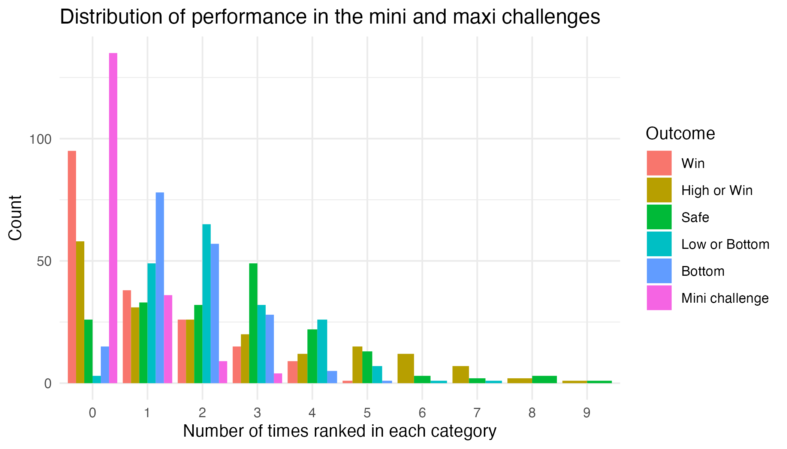
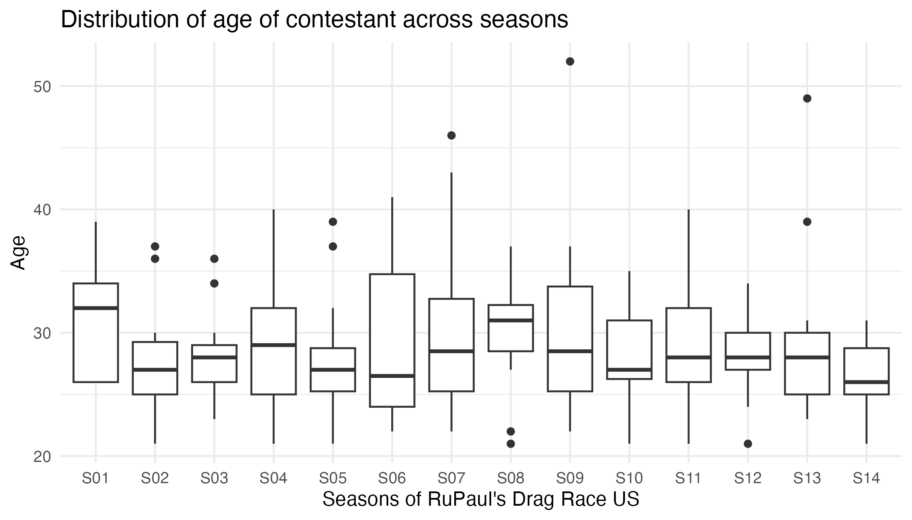
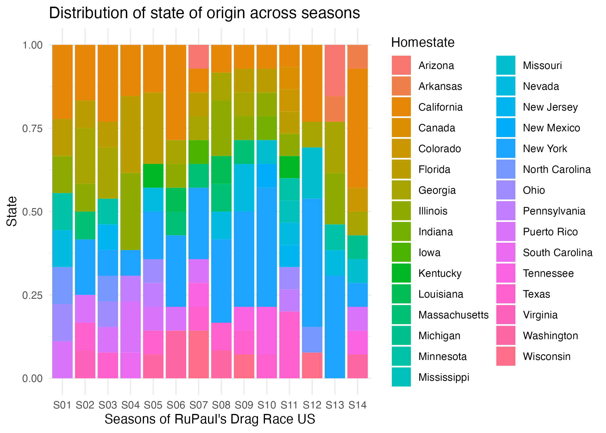

This projects aims at investigating the predictive value of outcomes
from the award-winning TV show RuPaul’s Drag Race. RuPaul’s Drag Race is
an American reality competition television series that first aired in
2009 and currently counts 14 seasons. The original American show has
given rise to spin-offs such as RuPaul’s Drag Race All Stars, and
international versions such as in Canada, UK, France, Thailand, Holland,
Spain, Australia/New Zealand, and Italy. This project will focus
specifically on the original American version of the show, and including
all seasons that has aired to date, namely seasons 1 through 14.

In each iteration of the competition, 9 to 16 contestant participate in
weekly challenges assessing their drag queen qualities. Contestants are
called “queens”, which is short for “drag queens” or drag performers.
They are eliminated one by one until a winner is declared and earns the
title of “America’s Next Drag Superstar”. The challenges include
designing, sewing, dancing, singing, performing lip-synchs, acting and
comedy.

The worldwide community of fans of the show are very active online. A
part of the online discussions of the show include discussions on
whether the winner of particular titles can be predicted based on some
specific factors. There is for example a very wide spread belief that
winning the fan-favorite “Snatch Game” challenge is a great predictor
for winning the overall competition. This is supported by the wins from
Jinkx Monsoon, Bob the Drag Queen, Aquaria, and Gigi Goode in seasons 5,
8, 10, 12. Another example that is frequently mentioned on the show is
the supposed superiority of contestants who are from New York City. The
aim of this project is to assess whether some of these variable are
actually predictive of one of two outcomes: a) winning the competition,
or b) being crowned “Miss congeniality”, a honorary title given to one
of the participants who showed the most friendly and positive spirits
and behavior during the competition. I choose exposure variables to
include some of the most frequently discussed factors in the fan
community, as well as socio-demographic factors that may affect the
performance. The exposure variables I will consider are: age of
contestant when the show aired, the homestate of the participant,
whether the contestant participate in the final episode (the finale),
their overall rank, whether the contestant won the “Snatch Game” comedy
impersonation challenge, and their number of mini-challenge wins, number
of times winning a maxi-challenge, number of times ranking in the ‘win
,’win or high’, ‘safe’, ‘low or bottom’, and ‘bottom’ categories of the
weekly maxi-challenge. I have made Figure 1A to illustrate how the
ranking variables are distributed across the 184 queens. I have this
information on 184 queens, which participated in 14 seasons. I have
additionally generated Figures 1B and 1C to show the distribution of age
and home state across participants and seasons. I decided to use a
logistic regression on each of the two outcomes, as those are binary
outcomes (winner yes/no, and miss congeniality yes/no). Then, I
additionally construct a predictive model for both outcomes.

I thought that added value could be brought by making efficient
visualization of some of the data. I decided to make plots showing the
trajectory of each competitor in each of the seasons of the competition.
I meant those as a way to visually assess the performance of each of the
contestant, as well as the global picture of each season. I picked
alluvial plots, are those are both visually appealing and easy to
comprehend.

**Figure 1A**

**Figure 1B**

**Figure 1C**

