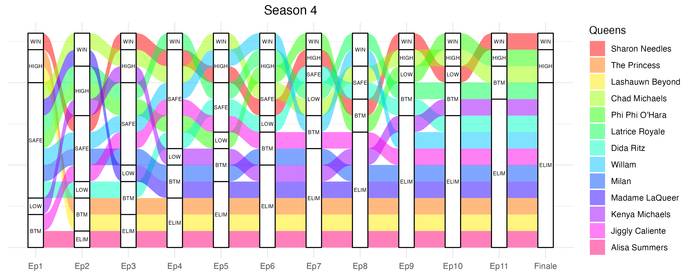
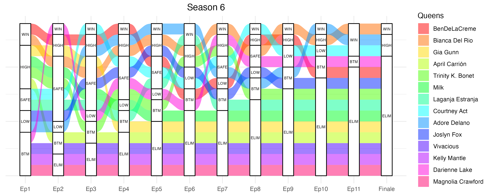
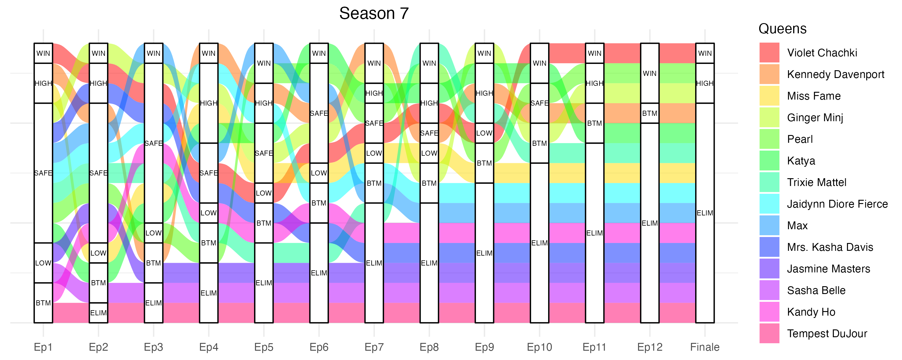
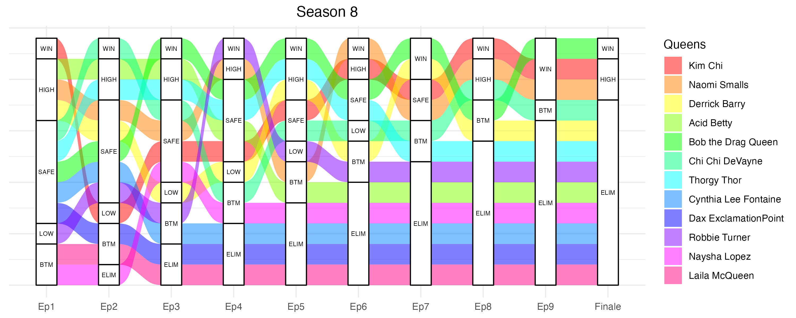
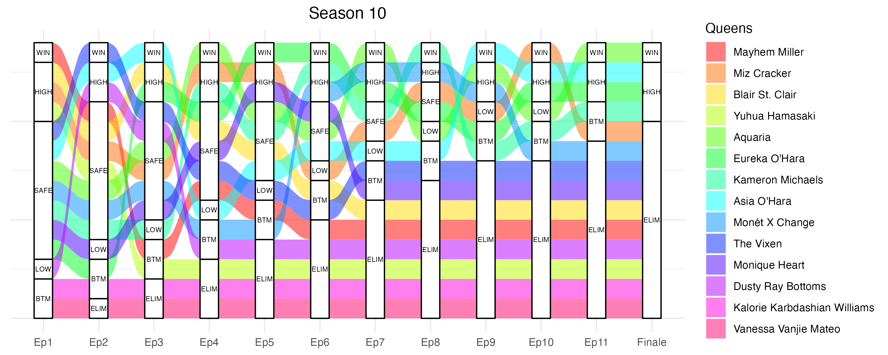
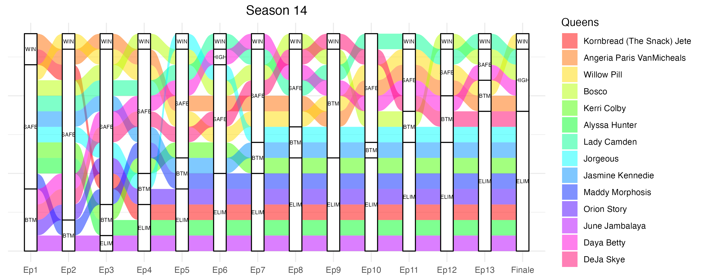

I addition to the regression model, I decided to make plots for each season representing the performance of each candidate. Those can be found in Figures 2 to 15 below. 
I picked alluvial plots due to their visual appeal, because they are an efficient way to show the trajectory of multiple participants at the same time and because I had never made one and wanted to learn. 

I find these plots interesting as they allow the reader to get a grasp of a queen's performance in a glance. For example, Bianca Del Rio, a participant in season 6 (represented in orange on Figure 7) is notorious for having performed extremely well on her season. She never fell in the bottom, was safe only 3 times and ended up winning the season. This is easy to visualize on the alluvial plot.

### Figure 2

### Figure 3

### Figure 4

### Figure 5

### Figure 6

### Figure 7

### Figure 8

### Figure 9

### Figure 10

### Figure 11

### Figure 12

### Figure 13

### Figure 14

### Figure 15

